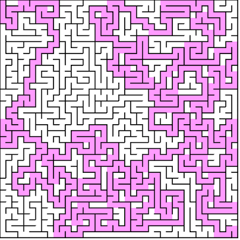
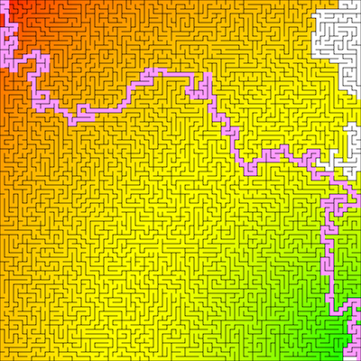
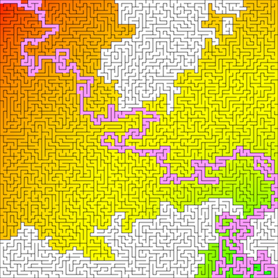

# Mazes
[](https://travis-ci.com/N02870941/mazes)

A simple maze generator and solver available in the form of a [web app][site].

# Intuition
One way of describing the process of generating and solving a maze is through graph theory. For the
purpose of clarity, we will use the words maze and graph interchangeably. If you
are not familiar with graph theory, here is an explanation of the information
about graph theory that is relevant to understand this problem.

A graph `G` is a pair denoted as `G = {V, E}` where `V` is a set of vertices and
`E` is a set of edges where each edge connects some vertex `u` to some vertex `v` from the vertex set `V`. A vertex is an abstract
**node or location** in a network. An edge is a **branch** that links vertices together. Graphs
come in various ways:

1. Weighted
2. Directed

Any combination is valid:

1. Weighted and directed
2. Weighted and undirected
3. Unweighted and directed
4. Unweighted and undirected


<p align="center">
  <br>
</p>

A weighted graph is a graph where edges have a specified **weight** or **cost** associated
with branching two vertices. For example, if we represent a country as a graph where
cities are vertices and roads are edges, the weight of an edge might be the distance between
each city.

<p align="center">
  <br>
</p>

A directed graph is a graph where an edge `e`  from vertex `u` to
`v` is not equal to an edge `f` from `v` to `u` - they are directional. For example, in our city
graph we may have an edge (road) from New York to Chicago with weight 200 miles.
But, we have a **different** edge going from Chicago to New York that is 250 miles because the return route may require taking a different road.

<p align="center">
  <br>
  <i>Undirected, weighted graph with uniform costs that represents a 2 x 2 pixel image.</i>
</p>

For the purpose of representing a maze, we will use an undirected weighted graph.
We will consider vertices white pixels (or square groups of white pixels) and edges will be
placed between adjacent pixels. A vertex is considered adjacent or having an edge with another vertex if there is **no** barrier (black pixels) between them. Edges will have a uniform weight of 1 which
just indicates that two vertices are one pixel away from each other (adjacent).

<p align="center">
  <br>
  <i>A 30 x 30 square grid that represents a graph with <strong>no</strong> edges.</i>
</p>

It is worth noting for this particular implementation, we will have a
tad of redundancy where each cell in the grid has information regarding all 4
adjacent vertices. This causes overlap in that for a vertex `u` that is to the
left of vertex `v`, `u`'s `right` vertex is the same as `v`'s `left` vertex pointer.
So from a technical coding standpoint, the graph created in memory will be directed, but edges `{u,v}` and `{v,u}` will
be treated the same. For example, if we delete one, we delete the other. So we still consider the graph undirected.
This can be optimized if an abstract "`Graph`" object were created in memory. But, that
is unnecessary for the scope of this problem.

# Maze generating
Generating a maze requires a modified graph traversal algorithm. Traversing the graph means to
**visit** each node (usually) from a specified starting vertex. If an undirected graph is
**connected** then there exists a path from each vertex to every other vertex in the graph.

<p align="center">
  <br>
  <i>A connected unweighted graph.</i>
</p>

In the case of a **blank** `n x n` image where `n` is the width (and height) of the image
in pixels, the image **always** represents connected graph. The reason is that
there are no missing pixels. So, in terms of
traversing the image, there exist a path from each white pixel to every other white pixel - this is too many
in fact. 

This is why we have black lines to represent the **absence** of edges, or a boundary that terminates a particular path. But, in the case of our full grid, we have too many boundaries as well - resulting in zero paths. 

Our goal is to traverse our image full of boundaries and **remove** (recreate) as many (paths) as possible but still resulting in a graph that has the connected property. This will result in a maze that leaves a
**path** from any vertex to any other vertex, but in a much less cluttered way.
The result is called a **spanning tree**.

<p align="center">
  <br>
  <i>A spanning tree of the above graph.</i>
</p>

A spanning tree `S` is a sub-graph of a graph `G = {V, E}` that contains the minimum
number of edges required to connect all vertices in `G`. If we denote the number of
vertices as `|V|` and number of edges as `|E|`, then for graph `S`, `|V'| = |V|` and `|E'| = |V| - 1`. It also turns out that graph `S` has the **acyclic** property of a graph. 

<p align="center">
  <br>
  <i>A cyclic graph, and it's acyclic sub-graph.</i>
</p>

A graph is acyclic if there is **no way** to start
at a specified vertex `v` and follow an alternating sequence of vertices and edges `v1, e1, v2, e2...`
where edge `ei` connects `vi` and `vi+1` and visit the same vertex twice. In other words, there
are no loops or repitition in a walk of the graph.

For simplicity, we will consider white (squares of) pixels valid vertices, and black (lines of)
pixels the absence of a connecting edge. This means, as we go through our graph removing walls, we will
be generating a continuous path of white pixels that represent traversable vertices
in the graph. Black pixels that are left over will be the walls of the maze. They
are the absence of edges, or area that does not allow us to go from one vertex to another.

<p align="center">
  <br>
  <i>Our result once the correct amount of walls is removed will look like this.</i>
</p>

Now that we have framed the problem, we can see some of the algorithms used to actually generate the mazes.

# Notes on runtime and space analysis

We will explore the runtime of both generating the maze, and solving it. But, before we do that
we must prove a few things and understand that runtime analysis on graphs is often times
dependent on **how** the graph is implemented. Let's explore the worst case scenarios.

As stated, a graph `G = {V, E}` can have a vertex set with cardinality `|V|`. Provided
that each vertex can be connected to at most, every other vertex, the cardinality of the edge set
`E` can be expressed as `|E| ≈ |V|²`. **However, for this particular problem, we can assert otherwise**.

The reason is because we are working on an image where edges only exist between **adjacent** pixels. A pixel can only be adjacent to at most 4 other vertices.
Consider a grid composed of n x n pixels or n² vertices. 


A vertex has at most 4 adjacent vertices:

1. Top
2. Bottom
3. Left
4. Right

We can also visualize each vertex from 0,0 to 0,k where k = n-1 as follows:


<p align="center">
  
</p>


We observe, that each vertex has 4 edges that point to the top, bottom, left, and right
adjacent vertices. In total, for `|V|` vertices we have 4 * `|V|` edges. `|E|` is linear with respect to `|V|`.
Although typically we say `O(|E|) = O(|V|²)`, for **this particular problem** we can say `O(|E|) = O(|V|) = O(n²)` where `n` is the number of boxes in our grid.

# Implementation details
There are many ways to represent a graph in memory. The typical implementations of the graph structure are Edge List, Adjacency Matrix, and Adjacency List. However, since this graph does not need to support all of the standard graph operations, we will implement a modified version of the adjacency list. We will have a single array called `grid` that represents a flattened `n x n` matrix of pixels / vertices. The `grid` array will be of type `Cell`.

```
Cell {

	walls     = 1111
	visited   = false
	cost      = Infinity
	heuristic = 0
}
```

Each `Cell` object contains a 4-bit binary string containing boolean values indicating whether or not any of the 4 walls are present for that `Cell`. If a particular bit is set to 0, then there is **no** wall, or there **is** and edge between that cell and the cell indicated by the position of the bit. If the bit is set to 1, a wall **does** exist or there is **not** an edge to the adjacent vertex. The bit mapping goes as follows:

| Bit | Neighbor |
|:---:| :------: |
| 0   | top      |
| 1   | right    |
| 2   | bottom   |
| 3   | left     |

For example, if `wall = 1010`, then the cell has a top, and bottom wall, but it does not have a left or right wall. In order to actually check the value of or modify on of the flags, we must use bitwise operations.

In regards to edge weight, there is no need to actually store that information. As noted, all edges have a weight of 1 because the distance between two adjacent pixels is always 1. So, we can simply ignore it. Instead, we just give each cell a `cost` field that represents the **aggregated weight** associated with **getting to** that vertex from a specified start vertex.

<p align="center">
  <br>
  <i>A walk from vertex A to I on a weighted graph.</i>
</p>

For a given walk of the graph, the cost of a vertex `v_i` is always the cost of vertex `v_(i-1) + 1`, where `v_(i-1)` is the vertex just before vertex `v` in the walk. So, when we traverse the graph, we just keep incrementing as we go instead of wasting space on information we can confidently predict and compute when it is needed. We see for vertices that we have not discovered or visited, by default their cost is infinite - this will come in handy when finding the shortest path between two vertices.

# Generating with backtracking

The [Randomized Depth / Breadth-first search][wiki] follows:

1. Make the initial cell the current cell and mark it as visited
2. While there are unvisited cells
    1. If the current cell has any neighbors which have not been visited
        1. Choose randomly one of the unvisited neighbors
        2. Push the current cell to the stack
        3. Remove the wall between the current cell and the chosen cell
        4. Make the chosen cell the current cell and mark it as visited

    2.Else if stack is not empty
        1. Pop a cell from the stack
        2. Make it the current cell

Pseudo code follows:

```
backtrack(src) {

	var unvisited = []  // Stack or Queue
	var neighbors = []  // Array
	var curr
	var next
	var i
	
	// Make the initial cell the current cell
	curr = src

	do {
	
		// Mark current as visited
		curr.visited = true
		
		// Get neighbors
		neighbors = curr.neighbors()
		
		// If at least one came back
		if (neighbors.length > 0) {
		
			// Pick random index
			i = random(0, neighbors.length)
		
			// Pick random neighbor	
			next = neighbors[i]
			
			// Push to stack
			unvisited.push(next)
			
			// Remove wall (create edge)
			removeWall(curr, next)
			
			// Point current to next
			curr = next
			
		// No neighbors, start backtracking
		} else {
		
			curr = unvisited.pop()
		}
	
	} while (unvisited.length > 0)

}
```

In essence, this algorithm starts at a vertex `u`, randomly visits an adjacent
vertex `v` that has not been visited yet - destroying barriers (walls of pixels) between
the current and previous vertices to create an edge, and repeats this until all vertices are visited and we have a spanning tree.

<p align="center">
  <br>
  <i>A maze generated with DFS..</i>
</p>

The above algorithm can be written as DFS, BFS, or even a hybrid. if implemented with DFS, the resulting maze will have a longer solution path, but relatively "easy" to solve by a computer using graph algorithms because there is a lower brancing factor. This means dead ends are relatively short, and there are less paths that are seemingly reasonable but lead no where. Instead, the solution may take many twists and turns around the entire maze to get to the target. We see there are less highlighted squares, meaning the path finding algorithm did not visit too many nodes that did not contribute to the final solution.

<p align="center">
  <br>
  <i>A maze generated with BFS.</i>
</p>

Generating the maze with BFS will result in a maze with much higher branching factor, meaning the depth of the tree will be lower. This means we will get a shorter path, so the maze is more solvable for humans. However, for graph algorithms, they will generally take longer to solve because there are many more "promising" paths that branch off to dead ends. Notice that the path finding algorithm visited nearly all nodes to find the optimal solution, even though by "looking" at it, the solution appears obvious.

<p align="center">
  <br>
  <i>A maze generated with BFS / DFS hybrid.</i>
</p>

Finally, we can implement a hybrid where sometimes we push, and sometimes we pop. This will result in a maze that is less difficult than DFS, so still solvable by a human, but less predictable than BFS so it remains interesting. Alternating between pushing and popping with 50:50 probability works well. Here we see, the path finding algorithm needed to visit a decent amount of nodes before finding the solution and the solution still seems "doable" by a human.

## Time complexity with backtracking
As noted, we are using depth / breadth-first search to generate the graph. To **traverse** a graph
we visit each node once, which is `O(|V|)`. But, we also must check all adjacent vertices per vertex.
This we can do in `O(1)` time because edges are simply stored as boolean values per grid cell.
We must check all four (top, bottom, left and right) edges, per vertex. This is `4 * O(1)`
which is still `O(1)`. So, we are doing `|V|` loop iterations, each of which does `O(1)` work.

**Generating the maze is done in** `O(|V|)` **time.**

## Space complexity with backtracking
The only auxiliary space we use is the stack / queue
structure for queuing vertices for processing. In the worst case, the depth / breadth-first search
traverses the entire graph without repetition / backtracking. This would mean all `|V|` vertices are
pushed on to the stack before any popping (visiting) occurs.

**Generating the maze required** `O(|V|)` **space.**

# Solving with Depth-first search (DFS)

A modified depth-first search can be used, stopping once we come across the
target vertex, then back tracking to discover the path from source to destination. This is a brute force method that may not always result in the optimal solution if there is more than one path from beginning to end. However, in practice it runs relatively fast in comparison to other search algorithms.

Pseudo code follows:

```javascript
dfs(src, dst) {

	var unvisited = []  // Stack
	var neighbors = []  // Set
	var parents   = []  // Map
	var current
	
	// The start vertex has no parent
	parents[src.key] = null
	
	// Start with source
	unvisited.push(src);
	
	// Process each vertex
	while (unvisited.length > 0) {
	
		// Get next vertex
		current = unvisited.pop()
		
		// We found the target
		if (current == dst) {
			
			break
		}
		
		// If first time visiting
		if (!current.visited) {
		
			// Label is visited
			current.visited = true
					
			// Get it's neighbors
			neighbors = current.neighbors()
			
			// Push all unvisited neighbors to stack
			neighbors.forEach( neighbor => {
			
				// If there is no path to this vertex yet
				if (!neighbor.visited) {
				
					// Create a mapping for backtracking
					parents[neighbor.key] = current.key
				
					// Add to start for processing
					unvisited.push(neighbor)
				}
			
			})
		}
	}
	
	// Start at destination	
	current = dst
	
	// Backtrack highlighting the path
	while (current) {
	
		current.highlight()
		
		current = parents[current.key]
	}

}
```

## Time complexity of DFS

Depth-first search visits all `|V|` vertices in the outer loop. Each loop iteration visits at most all of that vertex's edges, which for a grid is always 4. Discovering adjacent vertices is done in `O(1)` time. The `push()` and `pop()` operation on the stack are also done in constant time. So, `O(|V| * 1)` results in linear time with respect to vertices.

**The runtime of DFS is** `O(|V|)`.

## Space complexity of DFS

This depth-first search uses a stack of unvisitd vertices. In the worst case, we
push all `|V|` vertices before popping. This is the case where we visit **all** vertices in a single walk before hitting a dead end. The map used for backtracking in the worst case will hold references to all `|V|` vertices in the path from source to destination - also using at most `O(|V|)` space.

**The space complexity of DFS is** `O(|V|)`.

# Solving with Breadth-first search (BFS)

Breadth-first search is another general purpose graph traversal algorithm. The intuition behind BFS can be looked at as roughly the "opposite" of that of DFS. In DFS we try to go as deep as possible until we hit a dead end. With BFS, we try to go as wide as possible until we hit a dead end, or find our target. For acyclic graphs (trees) it is the equivalent of a level-order traversal. It also turns out that the only difference between implementing BFS and DFS is the data structure used to process vertices. For DFS we used a stack (FILO) structure. For BFS we will use a standard queue (FIFO) structure. The code is otherwise, roughly the same.

Pseudo code follows:

```javascript
bfs(src, dst) {

	var unvisited = []	// Queue
	var neighbors = []	// Set
	var parents   = []	// Map
	var current
	
	// The start vertex has no parent
	parents[src.key] = null
	
	// Start with source
	unvisited.enqueue(src);
	
	// Process each vertex
	while (unvisited.length > 0) {
	
		// Get next vertex
		current = unvisited.dequeue()
		
		// We found the target
		if (current == dst) {
			
			break
		}
		
		// If first time visiting
		if (!current.visited) {
		
			// Label is visited
			current.visited = true
					
			// Get it's neighbors
			neighbors = current.neighbors()
			
			// Push all unvisited neighbors to stack
			neighbors.forEach( neighbor => {
			
				// If there is no path to this vertex yet
				if (!neighbor.visited) {
				
					// Create a mapping for backtracking
					parents[neighbor.key] = current.key
				
					// Add to start for processing
					unvisited.enqueue(neighbor)
				}
			
			})
		}
	}
	
	// Start at destination	
	current = dst
	
	// Backtrack highlighting the path
	while (current) {
	
		current.highlight()
		
		current = parents[current.key]
	}

}
```

## Time complexity of BFS

Breadth-first search's outer loop visits all `|V|` vertices. Within each loop iteration, we perform one `dequeue()` and at most 4 `enqueue()` operations - constant time. Discovering adjacent vertices is also done in constant time. In total, we have `|V| * O(1)` which is `O(|V|)`.

**The runtime of BFS is** `O(|V|)`.

## Space complexity of BFS

To process vertices, BFS uses a queue. In the worst case, the queue is storing all the vertices - `O(|V|)`. We also use a map to store references to vertices to reconstruct the path. In the worst case, the map holds references to all vertices - `O(|V|)`.

**The space complexity of BFS is** `O(|V|)`.

# Solving with Dijkstra's algorithm

We can (theoretically) improve the above BFS by running Dijkstra's algorithm, which is a generic shortest path algorithm for arbitrary weighted graphs. Instead of blindly visiting each unvisited adjacent vertex until we have found our target, we will give them a priority. We will visit adjacent verticies that have **lower** associated cost first. This is a greedy approach that takes steps that may be optimal for
**intermediate** solutions, but not optimal for the **overall** solution. So we run the risk of diverging off on to many sub-optimal paths if the maze has a high branching factor.

In fact, since each adjacent vertex has the same cost to visit, if the graph only has **one solution**, Dijkstra will behave exactly like a greedy BFS.

The only way we get value out of Dijkstra's algorithm is if there are **multiple ways** to get to the same vertex because that way we could actually **compare** and update costs if a **better** route is found. With this in mind, it makes it clear that the added benefit of Dijkstra's algorithm is null and void unless the maze has multiple solutions. 

Pseudo code follows:

```javascript
dijkstra(graph, src, dst) {

	var unvisited = []	// Heap
	var neighbors = []	// Set
	var parents   = []	// Map
	var current
	var cost
	
	// Add to heap with initial cost of infinity
	graph.verticies.forEach( v => {
	
		if (v != src) {
		
			v.cost = Infinity
	
			unvisited.push(v)
		}
	
	})
	
	// The start vertex has no parent
	parents[src.key] = null
	
	// Cost to get to start is 0
	src.cost = 0
	
	// Push source
	unvisited.push(src)
	
	// Process each vertex
	while (unvisited.length > 0) {
	
		// Get next vertex with min cost
		current = unvisited.min()
		
		// Label is visited
		current.visited = true
		
		// We found the target
		if (current == dst) {
			
			break
		}
				
		// Get it's neighbors
		neighbors = current.neighbors()	
		
		// Discover each neighbor
		neighbors.forEach( neighbor => {
		
			// Compute cost to go over one vertex
			cost = current.cost + 1
					  			
			// Have we found a shorter path to this vertex?
			if (cost < neighbor.cost) {
			
				// Update the cost
				neighbor.cost = cost
				
				// Update path map to indicate new parent vertex
				parents[neighbor.key] = current.key
				
				// Decrease the key of the neighbor with new cost
				unvisited.decreaseKey(neighbor, cost
			 	
			}
		
		})

	}
	
	// Backtrack using parent map to display path

}
```

## Time complexity of Dijkstra

For this particular problem, we have chosen to implement Dijkstra's
algorithm with a min priority binary heap. We must loop through `|V|` vertices. For each iteration, we perform 1 `pop()` which is `O(log |V|)` and at most 4 `push()` operations for each adjacent neighbor - also `O(log |V|)`. So, multiplying the inner runtime by the outer runtime, we get `O(|V| * log |V|)`.

**Solving the maze with Dijkstra's algorithm is done in** `O(|V| * log |V|)` **time.**

## Space complexity of Dijkstra

Dijkstra's algorithm uses a priority queue to process unvisited vertices. In the worst case we will push `|V|` vertices before our first pop. We also use a map for backtracking to discover the path from source to destination. Since we are **only working with spanning trees**, the max size of a path is `|V| - 1`. In fact, no **path** in a graph can have more than `|V|` vertices because a path by definition says a vertex cannot be repeated. So, the map cannot grow greater than `O(|V|)`. 

**The space complexity is** `O(|V|)`.

# Solving with A* search

The limitations of Dijkstra's algorithm is the reason we use A* (A Star). A* is an **informed search** that uses a heuristic function to help guide our search.

## What is a heuristic?

The heuristic is an easy-to-compute value computed for each discovered vertex that we use to determine whether or not we are getting closer to our target. The equation follows. 

<p align="center">
  <br>
</p>


The function `g(n)` is the cost associated with getting to that vertex. `h(n)` is the estimate (heuristic) cost **between** that vertex and the target vertex. The sum `f(n)` is an overall **estimated** cost from start to finish if the current node is in the final solution. In other words:

*"If we visit node* `n`*, we anticipate the overall cost of the solution to be* `f(n)` *based on how far we have gone,*`g(n)` *plus how far we think we have to go,*`h(n)`*."*

For this reason, when ordering nodes in the priority queue, we want to sort such that nodes that warrant smaller `f(n)` values have higher priority. 

## Restrictions on heuristics
The `h(n)` function is very useful in that it helps us rule out expanding too wide and taking too many intermediate steps that stray away from the target. 

However, there are some restrictions on `h(n)`. 

1. The unit should be the same as that `g(n)`.
2. It **should** be admissible.

If the unit of the heuristic function is not the same as the unit used by `g(n)`, then we are not approximating the **cost** - we are computing some other value. For example, for grids, sometimes the euclidian distance squared is used as the heuristic. If we are computing distance in centimeters, `g(n)` is in centimeters, and `h(n)` is in centimeters squared. We cannot add centimeters and centimeters squared. If we add just their magnitudes (ignoring units), provided that centimeters squared is an order of magnitude larger than centimeters, we will be imposing a **huge** bias on the heuristic over the aggregated cost `g(n)`. It turns out weighting the heuristic may be a good thing, but there are also some draw backs - most notabely that it breaks admissibility.

A heuristic function is **admissible** if it never overestimates. For the purpose of traversing a weighted graph using A*, this means the heuristic never returns an estimate path cost that exceeds the minimum cost path from the current node to the target. If it does, then the `f(n)` overestimates, gets assigned a lower priority in the priority queue, and potentially never gets explored if the target is found before it is dequeued. This will result in a sub-optimal solution because we have **narrowed the search too much**. 

The advantage of a non-admissible heuristic is if there are not many obsticals A* will not stray off on to too many paths because it is making decisions almost entirely based on the heuristic. For a good heuristic, this means we will find a solution very quickly - often times in a small amount of steps. The disadvantage is that a heuristic that overestimates is effectively overlooking potentially better options - kind of like tunnel vision. 

So, even though A* with a weighted heuristic will run very fast, if it is not admissible, it may not always return the optimal solution. For most applications this is okay, as it may be more valuable to find a solution that is slighlty sub-optimal extremely quickly than to do a near exhaustive search to find the exact optimal solution. There is math that says that we can pick a non-admissible heuristic that guarantees solutions with a cost that is some scalar multiple ε of the optimal solutions cost, where ε ≥ 1. Essentially we are "limiting the inefficiency" of the solution by some epsilon. This is called an ε-admissible heuristic. However, that is beyond the scope of this project.

## Chosing a heuristic
Deciding on a heuristic function is highly dependent on the nature of the problem. For example, for a grid where diagonal movement is allowed, the straight-line (euclidian) distance is a good choice. 


However, for grids where only lateral movement is allowed euclidian almost always **underestimates**. This is okay, as it will still lead to an optimal solution, but because it consistently underestimates, we will branch out very far and explore many more options than necessary. A better heuristic is manhattan distance. 

Manhattan distance is essentially creating a triangle between two points and instead of taking the length of the hypotenuse (euclidian distance), we sum the lengths of the other two sides. It can also be seen as follows:

*You are in the upper-west side of Manhattan and you would like to get to the lower-east side. You compute your distance to your target by counting the number of blocks downtown you must walk and summing that with the number of blocks crosstown you must walk.*

This gives us a more accurate yet still admissible approximation. In fact, for our purpose, if our maze had no walls, the manhattan distance would be a perfect heuristic, meaning it always estimates the exact distance to the target every time, thus producing a search that finds the optimal solution on it's first try and does not visit vertices that do not contribute to the final solution.

## Implementing A*
The code for A* is nearly identical to that of Dijkstra's algorithm. The only difference is the function used when assigning order in the priority queue.

Pseudo code follows:


## Time complexity of A*

A* in the worst case degrades to Dijkstra's algorithm. This occurs when the heurisitc function severly underestimates on each iteration and never rules out any adjacent nodes to visit. In other words, if `h(n) = 0` for all nodes, A* is equivalent to Dijkstra's algorithm. In that event, we visit all `|V|` vertices, each of which requires a `log |V|` extract min operation on the min heap. This results in `O(|V| * log |V|)` operations.

**Solving the maze with A* is done in** `O(|V| * log |V|)` **time.**

## Space complexity of A*

A* uses a priority queue of unvisited vertices. In the worst case, we
push all `|V|` vertices before popping. This is the case where we visit **all** vertices in a single walk before hitting a dead end. The map used for backtracking in the worst case will hold references to all `|V|` vertices in the path from source to destination - also using at most `O(|V|)` space. Lastly, if we pre-compute our heuristics for easy lookup (one per vertex), we will need `O(|V|)` extra space - still resulting in linear space.

**The space complexity of A* is** `O(|V|)`.

# Performance comparison when solving (in practice)
The asymptotic runtime of solving the maze is roughly the same for each solution. Generally speaking, it is `|V|` multiplied by the longer runtime between the `push()` and `pop()` operation for the specified data structure used to queue unvisited nodes. 

For DFS and BFS we use stack and queue respectively, each of which performing `push()` and `pop()` in `O(1)` time - hence `O(|V|)` overall runtime. For A* and Dijkstra we use a priority queue that performs `push()` and `pop()` in `O(log |V|)` runtime - hence `O(|V| * log |V|)` overall runtime. This is the worst case. 

We are not going to prove the average case runtime because the math can get quite complex. However, we are going to look at **runtime in practice** to make some **observations** and potentially determine one of the methods as the best method for solving the **mazes generated by this** application.

We start with a 300 x 300 square maze.

<p align="center">
  <br>
  <i>A maze generated with BFS + backtracking.</i>
</p>

Above is a 300 x 300 square maze with 40% of the vertical walls removed and 52% of the horizontal walls removed so that there are many paths from start to finish.  When searching for our target (from top left to bottom right) there are a total of 90,000 squares we can visit before exhausting our search and there is an optimal path length of about 599. Note, multiple optimal solutions may exist.

<p align="center">
  <br>
  <i>Maze solved with DFS.</i>
</p>

Here we solve with depth-first search. Meaning we go as deep as possible before turning around and trying new paths. It works, but it does not give us an optimal solution. Here we found the target by visiting 6574 squares with a path of length 5017. We visited 7% of the grid, but do not have an good solution.

<p align="center">
  <br>
  <i>Maze solved with BFS.</i>
</p>

We can find the optimal path by using a brute force method. This means try every option until we eventually stumble across the solution. One way to do that is breadth-first search. Which is, expanding as wide as possible before turning around. This gives us the optimal solution of length 599 but we visited all 90000 squares to find it. Not efficient.

<p align="center">
  <br>
  <i>Maze solved with Dijkstra's algorithm.</i>
</p>

In theory, we could improve BFS by using Dijkstra's algorithm. Which is a uniform cost search algorithm that choses to visit vertices that contribute minimally to the overall cost. Unfortunately, for a maze, the cost to make any turn is always exactly 1, so we are technically sorting 1's every time. Dijkstra's algorithm degrades to best-first search (almost identical to BFS) and acts nearly identically to BFS. The only difference is sometimes the shape of the path. Here we still visited all 90000 squares to compute an optimal path of length 599.

<p align="center">
  <br>
  <i>Maze solved with A* using euclidian distance as the heuristic.</i>
</p>

Another improvement to solving the maze is using the A* search using the euclidian distance as the heuristic. However, since the euclidian distance will often be a diagonal line, this heuristic consistantly underestimates because we **cannot actually go diagonally**. So, it only helps us eliminate the extreme corners. So, we still branch off pretty far. We visited 84729 out of 90000 squares. We visited 94% of all squares - very inefficient. 

<p align="center">
  <br>
  <i>Maze solved with A* using manhattan distance as the heuristic.</i>
</p>

An improvement to A* where only perpendicular movement is allowed is changing the heuristic to manhattan distance. That is, rather than computing straight line distance, we imagine we are in the city of New York, trying to get to from the upper west side to the lower east side. We count the number of blocks downtown we must walk and then add that to the number of blocks east we walk. This gives us a very close approximation as to how many squares we must visit. This produced a path of length 599 but we only visited 15764 squares - 17% of the maze. 

However, we still notice that we are visiting many squares that do not contribute to the final result. The reason is because we have no mechanism for breaking ties between equally good options. For example, we see for this maze, many optimal solutions lie both above and below the straight line from the top-left corner to the bottom-right corner. If we are on a vertex that lies on the line, the vertices both above and to the right of our current position are equally good choices. We consider this a tie. Presently, we have no mechanism for breaking this tie so we explore both. We must add a tie-breaker.

<p align="center">
  <br>
  <i>Maze solved with A* using weighted manhattan distance as the heuristic.</i>
</p>

Another improvement to A* is adding a weight to the heuristic, or a tie breaker. This allows us to impose a bias when we come across 2 equally weighted choices. This however, if it ever overestimates, will cause A* to output a slightly sub-optimal result. This breaks the admissible property of the heuristic. However, for most applications, this is okay if we are one or two steps off. The benefit is that depending on how much we weight the heuristic, we avoid straying off onto different paths. 

For this particular application,  we consider a step in a particular direction a vector. We compute the determinant of that step vector and the vector from origin to target. We then use some multiple of this value to add that to our heuristic (manhattan distance).

The reason we do this is because the determinant of any 2d vectors tells us information about the angle made between the two vectors. The closer these vectors are to parallel, the small that angle gets - eventually reaching 0 if the vectors are perfectly parallel.

So, if we are above the line, and we have an equal choice to go right (further from the line) or down (closer to the line), even though the cost of both steps is 1 (equal), we break this tie by choosing the vector that produces an angle "most parallel" to the straight line from origin to target, which in this case is down because we are rotating towards the line rather than away from it.

This approach produces the optimal solution of length 599 in 2740 total visits. This is about 3% of the total number of squares. This is a highly efficient approach, although sometimes producing slightly sub-optimal solutions depending on admissibility of the heuristic.

## Conclusion
Clearly using A* with weighted manhattan distance is the fastest approach at finding a solution. If the maze had one solution, it may perform nearly identically to unweighted manhattan. But, we see the biggest pitfall of A* is tiebreaking. However, this can be easily overcome by slightly breaking admissibility. This is often the favored approach in real life - getting results more quickly even though they may be slightly sub-obtimal.

# How to run
Ensure you have docker installed before running the following commands:

```
docker pull jabaridash/mazes

docker run -p 8080:80 jabaridash/mazes
```

You can also run it from source if you have git and node 8+ installed:

```
git clone https://github.com/N02870941/mazes.git

cd mazes/src

npm install

gulp dev
```

[site]: http://mazes.jabaridash.com
[wiki]: https://en.wikipedia.org/wiki/Maze_generation_algorithm
[youtube]:https://www.youtube.com/watch?v=HyK_Q5rrcr4
