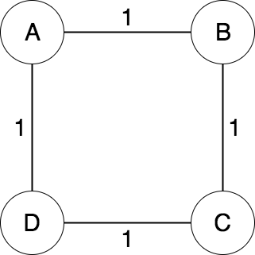
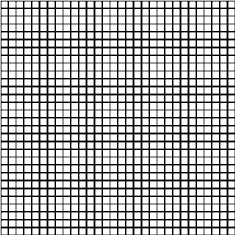
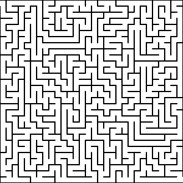
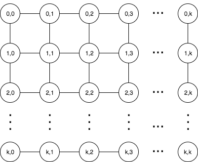

# Mazes
[](https://travis-ci.com/N02870941/mazes)

A simple maze generator and solver available in the form of a [web app][site].

# Intuition
Maze generating and solving can be described in terms of graph theory. For the
purpose of clarity, we will use the words maze and graph interchangeably. If you
are not familiar with graph theory, here is a **brief** explanation of the information
relevant to understand this problem.

A graph `G` is a pair denoted as `G = {V, E}` where `V` is a set of vertices and
`E` is a set of edges that where each edges connects in the set `V`. A vertex is an abstract
*node* in a network. An edge is a *branch* that links two vertices or nodes. Graphs
come in various ways:

1. Weighted
2. Directed

You can have any combination:

1. Weighted and directed
2. Weighted and undirected
3. Unweighted and directed
4. Unweighted and undirected


<p align="center">
  <br>
</p>

A weighted graph is a graph where edges have a specified **weight** or **cost** associated
with branching two vertices. For example, if we represent a country as a graph where
cities are vertices and roads are edges, the weight of an edge might be the distance between
each city.

<p align="center">
  <br>
</p>

A directed graph is a graph where an edge `e`  from vertex `u` to
`v` is not equal to an edge `f` from `v` to `u`. For example, in our city
example, we may have an edge from New York to Chicago with weight 200 miles.
But, the edge going from Chicago to New York may be 250 miles because that
edges represent a different roads.

<p align="center">
  <br>
  <i>Undirected, weighted graph with uniform costs that represents a 2 x 2 pixel image.</i>
</p>

For the purpose of representing a maze, we will use an undirected weighted graph.
We will consider vertices white pixels (or square groups of pixels) and edges will be
placed between adjacent pixels. A vertex is considered adjacent or having an edge with another vertex if there is **no** barrier (black pixels) between them. Edges will have a uniform weight of 1 which
just indicates that two vertices are one pixel away from each other (adjacent). We
do not need to make it directed because pixels have uniform size, thus a
uniform distance if they are adjacent.

<p align="center">
  <br>
  <i>A 30 x 30 square grid that represents a graph with <strong>no</strong> edges.</i>
</p>

It is worth noting for this particular implementation, we will have a
tad of redundancy where each cell in the grid has information regarding all 4
adjacent vertices. This causes overlap in that for a vertex `u` that is to the
left of vertex `v`, `u`'s `right` vertex is the same as `v`'s `left` vertex pointer.
So from a technical coding standpoint, it will be directed, but edges `{u,v}` and `{v,u}` will
be treated the same. So if we delete one, we delete the other. So we still consider it undirected.
This can be optimized if an abstract "`Graph`" object were created in memory. But, that
is unnecessary for the scope of this problem.

# Maze generating
Generating a maze requires a modified depth-first search of the graph. A depth-first
search is an algorithm used to **traverse** a graph. Traversing the graph means to
*visit* each node (usually) from a specified starting vertex. If an undirected graph is
**connected** then there exists a path from each vertex to every other vertex in the graph.

<p align="center">
  <br>
  <i>A connected unweighted graph.</i>
</p>

In the case of a **blank** `n x n` image where `n` is the width (and height) of the image
in pixels, the image *always* represents connected graph. The reason is that
there are no missing pixels assuming your photo is not corrupted. So, in terms of
traversing the image, there exist a path from each pixel to each other pixel - this too many
in fact. This is why we have black lines to represent **absence** of an edge, or a boundary that terminates a particular path. But, in the case of our full grid, we have too many boundaries as well - resulting in zero paths. Our goal is to traverse our image full of boundaries and **remove** as many as possible but still resulting in a graph that has the connected property. This will result in a maze that leaves a
**path** from any vertex to any other vertex, but in a much less cluttered way.
The result is called a **spanning tree**.

<p align="center">
  <br>
  <i>A spanning tree of the above graph.</i>
</p>

A spanning tree `S` is a sub-graph of a graph `G = {V, E}` that contains the minimum
number of edges required to connect all vertices in `G`. If we denote the number of
vertices as `|V|` and number of edges as `|E|`, then for graph `S`, `|V|`
remains the same, and `|E| = |V| - 1`. It also turns out that graph `S` meets the
criteria of an **acyclic** graph. 

<p align="center">
  <br>
  <i>A cyclic graph, and it's acyclic sub-graph.</i>
</p>

A graph is acyclic if there is *no way* to start
at a specified vertex `v` and follow an alternating sequence of vertices and edges `v1, e1, v2, e2...`
where edge `ei` connects `vi` and `vi+1` and visit the same vertex twice. In other words, there
are no loops or repitition.

For simplicity, we will consider white (squares of) pixels valid vertices, and black (lines of)
pixels the absence of a connecting edge. This means, as we go through our graph removing walls, we will
be generating a continuous path of white pixels that represent traversable vertices
in the graph. Black pixels that are left over will be the walls of the maze. They
are the absence of edges, or area that does not allow us to go from one vertex to another.

<p align="center">
  <br>
  <i>Our result once the correct amount of walls is removed will look like this.</i>
</p>

Now that we have framed the problem we can see some of the algorithms used to do this.

# Notes on runtime and space analysis

We will explore the runtime of both generating the maze, and solving it. But, before we do that
we must prove a few things and understand that runtime analysis on graphs is often times
dependent on **how** the graph is implemented. Let's explore the worst case scenario.

As stated, a graph `G = {V, E}` can have a vertex set with cardinality `|V|` of vertices. Provided
that each vertex can be connected to at most, every other vertex, the cardinality of the edge set
`E` can be expressed as `|E| ≈ |V|²`. **However, for this particular problem, we can assert otherwise**.

The reason is because we are working on an image where edges only exist between **adjacent** pixels. A pixel can only be adjacent to at most 4 other vertices.
Consider a grid composed of n x n pixels or n² vertices. We are only considering adjacent vertices.
A vertex has at most 4 adjacent vertices:

1. Top
2. Bottom
3. Left
4. Right

We can also visualize each vertex from 0,0 to 0,k where k = n-1 as follows:


<p align="center">
  
</p>


We observe, that each vertex has 4 edges that point to the top, bottom, left, and right
adjacent vertices. In total, for `|V|` vertices we have 4 * `|V|` edges. `|E|` is linear with respect to `|V|`.
Although typically we say `O(|E|) = O(|V|²)`, for **this particular problem** we can say `O(|E|) = O(|V|) = O(n²)` where `n` is the number of boxes in our grid.

# Generating with Randomized Depth-first search

The [Randomized Depth-first search][wiki] follows:

1. Make the initial cell the current cell and mark it as visited
2. While there are unvisited cells
    1. If the current cell has any neighbors which have not been visited
        1. Choose randomly one of the unvisited neighbors
        2. Push the current cell to the stack
        3. Remove the wall between the current cell and the chosen cell
        4. Make the chosen cell the current cell and mark it as visited

    2.Else if stack is not empty
        1. Pop a cell from the stack
        2. Make it the current cell

In essence, this algorithm starts at a vertex `u`, randomly visits an adjacent
vertex `v` that has not been visited yet - destroying barriers (walls of pixels) between
the current and previous vertex to create an edge, and repeats this until all vertices are visited and we have a spanning tree.

## Time complexity with DFS
As noted, we are using depth-first search to generate the graph. To *traverse* a graph
we visit each node once, which is `O(|V|)`. But, we also must check all adjacent vertices per vertex.
This we can do in `O(1)` time because edges are simply stored as boolean values per grid cell.
We must check all four (top, bottom, left and right) edges, per vertex. This is `4 * O(1)`
which is still `O(1)`. So, we are doing `|V|` loop iterations, each of which does `O(1)` work.

**Generating the maze is done in** `O(|V|)` **or** `O(n²)` **time.**

## Space complexity with DFS
The only auxiliary space we use is the stack
structure for queuing vertices for processing. In the worst case, the depth-first search
traverses the entire graph without repetition / backtracking. This would mean all `|V|` vertices are
pushed on to the stack before any popping (visiting) occurs.

**Generating the maze required** `O(|V|)` **or** `O(n²)` **space.**

# Generating with Randomized Prim's algorithm

Prim's algorithm is an algorithm used to fine what's called the **minimum spanning tree** (MST). Just like the normal spanning tree, an MST contains a number of edges `|E|` such that `|E| = |V| - 1`. It also has the added property that the sum of the selected edges is minimum while still satisfying the connected property. It goes as follows:

1. Start with a grid full of walls
2. Pick a cell, mark it as part of the maze. Add the walls of the cell to the wall list
3. While there are walls in the list:
	1. Pick a random wall from the list. If only one of the two cells that the wall divides is visited, then:
		1. Make the wall a passage and mark the unvisited cell as part of the maze
		2. Add the neighboring walls of the cell to the wall list
2. Remove the wall from the list

**Note:** Since we have decided that all edge weights are uniform for this implementation, all spanning trees are minimum spanning trees because there will **always** be `|V| - 1` edges, each of which has a weight of one, resulting in a total cost of `|V| - 1` for all spanning trees.


# Solving with Depth-first search

A modified depth-first search can be used, stopping once we come across the
target vertex, then back tracking to discover the path from source to destination. This is a brute force method that would take a lot longer
and may not always result in the optimal solution if there were more than one path from beginning to end. Pseudo code follows:

```javascript
dfs(src, dst) {

	var unvisited = []	// Stack
	var neighbors = []	// Set
	var parents   = []	// Map
	var current
	
	// The start vertex has no parent
	parents[src.key] = null
	
	// Start with source
	visited.push(src);
	
	// Process each vertex
	while (unvisited.length > 0) {
	
		// Get next vertex
		current = unvisited.pop()
		
		// We found the target
		if (current == dst) {
			
			break
		}
		
		// If first time visiting
		if (!current.visited) {
		
			// Label is visited
			current.visited = true
					
			// Get it's neighbors
			neighbors = current.neighbors()
			
			// Push all unvisited neighbors to stack
			neighbors.forEach( neighbor => {
			
				// If there is no path to this vertex yet
				if (!neighbor.visited && !parents[neighbor.key]) {
				
					// Create a mapping for backtracking
					parents[neighbor.key] = current.key
				
					// Add to start for processing
					unvisited.push(neighbor)
				}
			
			})
		}
	}
	
	// Start at destination	
	current = dst
	
	// Backtrack highlighting the path
	while (current) {
	
		current.highlight()
		
		current = parents[current.key]
	}

}
```

## Time complexity of DFS

Depth-first search visits all `|V|` vertices in the outer loop. Each loop iteration visits at most all of that vertex's edges, which for a grid is always 4.

**The runtime of DFS is** `O(|V|)`.

## Space complexity of DFS

This depth-first search uses a stack of unvisitd vertices. In the worst case, we
push all `|V|` vertices before popping. This is the case where we visit **all** vertices in a single walk before hitting a dead end. The map used for backtracking in the worst case will hold references to all `|V|` vertices in the path from source to destination - also using at most `O(|V|)` space.

**The space complexity is** `O(|V|)`.

# Solving with Dijkstra's algorithm

We can improve the above DFS by running Dijkstra's algorithm, which is a generic shortest path algorithm for arbitrary weighted graphs. Instead of blindly visiting each unvisited adjacent vertex until we have found our target, we will give them a priority. We will visit adjacent verticies that have **lower** cost first. However,
this is a greedy approach that takes steps that may be optimal for
**intermediate** solutions, but not optimal for the **overall** solution. 

This may result in a quicker runtime the edges we visit all happen to getting us closer to our target. But the runtime will be just as bad as depth-first search if this is not true and we end up going down too many sub-optimal paths before generating the overall best solution. The latter is generally true for **randomly generated uniform edge-weight** graphs as the cost is directly correlated with the path length, which provided it's random nature, we have no information about.

## Time complexity of Dijkstra

For an arbitrary graph, Dijkstra's algorithm runs in `O(|V|²)` time (assuming an adjacency matrix is used). This is because we visit each vertex once - `O(|V|)`, and each potential edge for each vertex, which is `|V|` edges per vertex - `|V| * |V| = |V|²` . We improve this by
storing each vertex's adjacency list in a min-priority queue (Fibonacci Heap). This improves the runtime to `O(|E| + |V| * log |V|)`. 

However, as previously noted, for this problem, `|E| = 4 * |V|`. So, if we were to use a fibonacci heap for **this particular problem**, our runtime would be `O(|V| + |V| * log |V|)` or simply `O(|V| * log |V|)`. The `|V| * log |V|` portion comes from. The `extractMin()` operation which runs in `log |V|` times is called `|V|` times. 

Fortunately, we do not even need to sort our edges in a heap because there is **always exactly 4 potential adjacent vertices per vertex** no matter how many vertices we have in the entire graph. For an adjacency list of exactly 4 everytime, `extractMin()` is run in `O(1)` time. That being said, we make `|V|` calls to an `O(1)` operation.

**The runtime of DFS is** `O(|V|) = O(n²)`.

## Space complexity of Dijkstra

Dijkstra's algorithm uses a stack to process unvisited vertices. In the worst case we will push `|V|` vertices before our first pop. We also use a map for backtracking to discover the path from source to destination. Since we are **only working with spanning trees**, the max size of a path is `|V| - 1`. So the map cannot grow greater than `O(|V|)`. Lastly, Dijkstra uses another map that assocates each visited vertex with it's cost to get there. This grows no greater than the number of vertices `|V|`. So, summing all utilized space, we use `O(|V| + |V| + |V|) = O(3 * |V|) = O(|V|)`.

**The space complexity is** `O(|V|) = O(n²)`.

# Solving with A* search

The limitations of Dijkstra's algorithm is the reason we use A* (A Star) as our primary approach in **path finding**. It can be considered a generalization of Dijkstra's algorithm
that uses a heuristic value (specific to the problem) that prevents us from straying away on non-optimal paths and helps make more intelligent intermediate
steps that lead to the overall optimal solution. We can also say Dijkstra's algorithm is a specific case of A* where the heuristic of all adjacent vertices are equal or zero - thus having no impact on decision making. The heuristic is an easy-to-compute value computed per iteration (or beforehand) that we use to determine whether or not we are approaching our target. 

The heuristic is a problem-specific computation because for arbitrary graphs (a set of edges and vertices) we do not have any information about how "close" we are. Since we have our graph in terms of a grid, a good choice for the heuristic is the (euclidian or manhattan) distance between the current pixel and the target. 

Although we may not always have a **direct** path, we know we are getting closer if the euclidian distance is shrinking. With this new tool at our disposal, we make our choice to visit a particular vertex that not only minimizes overall cost, but also shrinks the distance between the current vertex in the search and the target vertex - this assures us we are "getting closer."

## Time complexity of A*

For all intents and purposes, if the heuristic underestimates every time or returns the same value for every vertex, A* degrades to a uniform cost search - aka Dijkstra's algorithm, which will explore each vertex, and in **this case** is `O(|V|)`. Even if our heuristic does estimate well (which it does with euclidian and manhattan distance), in the worst case, we still visit all `|E|` edges which we have proven to be `4 * |V|` for a grid where only adjacent pixels can have edges.

**Solving the maze with A* is done in** `O(|E|) = O(|V|)` **or** `O(n²)` **time.**

## Space complexity of A*

A* uses a stack of unvisited vertices. In the worst case, we
push all `|V|` vertices before popping. This is the case where we visit **all** vertices in a single walk before hitting a dead end. The map used for backtracking in the worst case will hold references to all `|V|` vertices in the path from source to destination - also using at most `O(|V|)` space. Lastly, if we pre-compute our heuristics for easy lookup (one per vertex), we will need `O(|V|)` extra space - still resulting in linear space.

**The space complexity of A* is** `O(|V|)`.

# How to run
Ensure you have docker installed before running the following commands:

```
docker pull jabaridash/mazes

docker run -p 8080:80 jabaridash/mazes
```

You can also run it from source if you have git and node 8+ installed:

```
git clone https://github.com/N02870941/mazes.git

cd mazes/src

npm install

gulp dev
```

[site]: http://mazes.jabaridash.com
[wiki]: https://en.wikipedia.org/wiki/Maze_generation_algorithm
[youtube]:https://www.youtube.com/watch?v=HyK_Q5rrcr4
