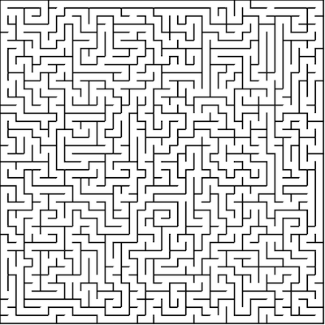

# Intuition
One way of framing the problem of generating and solving a maze is in terms of graph theory. For the
purpose of clarity, we will use the words maze and graph interchangeably. If you
are not familiar with graph theory, here is an explanation of the information
about graph theory that is relevant to understand this problem.

A graph `G` is a pair denoted as `G = {V, E}` where `V` is a set of vertices and
`E` is a set of edges. Each edge connects some vertex another vertex from the vertex set `V`. In other words, a vertex is a
**location** in a network and an edge is a **connection** between these vertices. Graphs
come in various forms:

1. Weighted
2. Directed

We can have any of the following types of graphs:

1. Weighted and directed
2. Weighted and undirected
3. Unweighted and directed
4. Unweighted and undirected

<p align="center">
  <br>
</p>

A weighted graph is a graph who's edges have a specified **weight** or **cost** associated
with connecting two vertices. For example, if we represent a country as a graph where
vertices are cities and edges are roads, the weight of an edge might be the distance between
two cities.

<p align="center">
  <br>
</p>

A directed graph is a graph where an edge `e`  from vertex `u` to
`v` is not equal to an edge `f` from `v` to `u`. In other words, edges are directional. For example, in our graph that represents a country we may have an edge (road) from New York to Chicago with weight 200 miles.
But, we have a **different** edge going from Chicago to New York that is 250 miles because the return route may require taking a different road.

<p align="center">
  <br>
  <i>Undirected, weighted graph with uniform costs that represents a 2 x 2 pixel image.</i>
</p>

For the purpose of representing a maze, we will use an undirected weighted graph.
We will consider vertices white pixel areas. A vertex is considered adjacent or having an edge with another vertex if there is **no** barrier (black pixels) between them. Equally speaking, edges exist between contiguous blocks of white pixels. Edges will have a uniform weight of 1 which
just indicates that two vertices are one pixel away from each other (adjacent).

<p align="center">
  <br>
  <i>A 30 x 30 square grid that represents a graph with <strong>no</strong> edges.</i>
</p>

# Maze generating
Generating a maze requires a modified graph traversal algorithm. Traversing the graph means to
**visit** each node from a specified starting vertex. If an undirected graph is
**connected** then there exists a path from each vertex to every other vertex in the graph.

<p align="center">
  <br>
  <i>A connected unweighted graph.</i>
</p>

In the case of a **blank white** `n x n` image where `n` is the width (and height) of the image
in pixels, the image **always** represents a connected graph. The reason is that
there are no black lines. So, in terms of
traversing the image, there exist a path from each white pixel to every other white pixel. In terms of a maze, there are too many paths.

This is why we have black lines to represent the **absence** of edges, or a boundary that terminates a particular path. But, in the case of our full grid, we have too many boundaries as well - resulting in zero paths.

Our goal is to traverse our image full of boundaries and **remove** as many walls as possible while maintaining the connected property of the graph. This will result in a maze that leaves exactly *one*
**path** from any vertex to any other vertex.
This is called a **spanning tree**.

<p align="center">
  <br>
  <i>A spanning tree of the above graph.</i>
</p>

A spanning tree `S` is a sub-graph of a graph `G = {V, E}` that contains the minimum
number of edges required to connect all vertices in `G`. If we denote the number of
vertices in `G` as `|V|` and number of edges as `|E|`, then for graph `S`, `|V'| = |V|` and `|E'| = |V| - 1`. It also turns out that graph `S` has the **acyclic** property of a graph.

<p align="center">
  <br>
  <i>A cyclic graph, and it's acyclic sub-graph.</i>
</p>

A graph is acyclic if there is **no way** to start
at a specified vertex `vi` and follow an alternating sequence of vertices and edges `v1, e1, v2, e2...`
where edge `ei` connects `vi` and `vi+1` and visit the same vertex twice. In other words, there
are no loops or repitition in a walk of the graph.

As we traverse the graph removing walls, we will
be generating a continuous path of white pixels that represent traversable vertices
in the graph. Black pixels that are left over will be the walls of the maze. They
are the absence of edges, or area that does not allow us to go from one vertex to another.

<p align="center">
  <br>
  <i>Our result once the correct amount of walls is removed will look like this.</i>
</p>

Now that we have framed the problem, we can see some of the algorithms used to actually generate the mazes.

# Notes on runtime and space analysis

We will explore the runtime of both generating the maze, and solving it. But, before we do that
we must prove a few things and understand that runtime analysis on graphs is often times
dependent on **how** the graph is implemented. Let's explore the worst case scenarios.

As stated, a graph `G = {V, E}` can have a vertex set with cardinality `|V|`. Provided
that each vertex in an **arbitrary** graph can be connected to at most, every other vertex, the cardinality of the edge set
`E` can be expressed as `|E| ≈ |V|²`. **However, for this particular problem, we can assert otherwise**.

The reason is because we are working on an image where edges only exist between **adjacent** pixels. A pixel can only be adjacent to at most 4 other vertices.
Consider a grid composed of `|V|` vertices.


A vertex has at most 4 adjacent vertices:

1. Top
2. Bottom
3. Left
4. Right

We can also visualize each vertex from `(0,0)` to `(k,k)` where `k = n - 1` as follows:


<p align="center">
  
</p>


We observe, that each vertex has 4 edges that point to the top, bottom, left, and right
adjacent vertices. In total, for `|V|` vertices we have 4 * `|V|` edges. `|E|` is linear with respect to `|V|`.
Although typically we say `O(|E|) = O(|V|²)`, for **this particular problem** we can say `O(|E|) = O(|V|) = O(n²)` where `n` is the number of boxes in our grid.

# Implementation details
There are many ways to represent a graph in memory. The typical implementations of the graph structure are Edge List, Adjacency Matrix, and Adjacency List. However, since this graph does not need to support all of the standard graph operations, we will implement a modified version of the adjacency list. We will have a single array called `grid` that represents a flattened `n x n` matrix of squares / vertices. The `grid` array will be of type `Cell`.

```
Cell {

	walls     = 1111
	visited   = false
	cost      = Infinity
	heuristic = 0
}
```

Each `Cell` object contains a 4-bit binary string containing boolean values indicating whether or not any of the 4 walls are present for that `Cell`. If a particular bit is set to 0, then there is **no** wall, or there **is** and edge between that cell and the cell indicated by the position of the bit. If the bit is set to 1, a wall **does** exist or there is **not** an edge to the adjacent vertex. The bit mapping goes as follows:

| Bit | Neighbor |
|:---:| :------: |
| 0   | top      |
| 1   | right    |
| 2   | bottom   |
| 3   | left     |

For example, if `wall = 1010`, then the cell has a top, and bottom wall, but it does not have a left or right wall. In order to actually check the value of or modify on of the flags, we must use bitwise operations.

In regards to edge weight, there is no need to actually store that information. As noted, all edges have a weight of 1 because the distance between two adjacent pixels is always 1. So, we can simply ignore it. Instead, we just give each cell a `cost` field that represents the **aggregated weight** associated with **getting to** that vertex from a specified start vertex.

<p align="center">
  <br>
  <i>A walk from vertex A to I on a weighted graph.</i>
</p>

For a given walk of the graph, the cost of a vertex `v_i` is always the cost of vertex `v_(i-1) + 1`, where `v_(i-1)` is the vertex just before vertex `v_i` in the walk. So, when we traverse the graph, we just keep incrementing as we go instead of wasting space on information we can confidently predict and compute when it is needed. We see for vertices that we have not discovered or visited, by default their cost is infinite - this will come in handy when finding the shortest path between two vertices.
