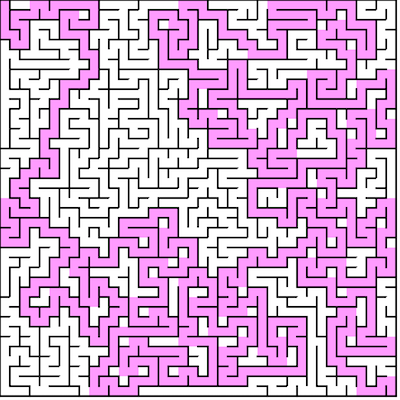
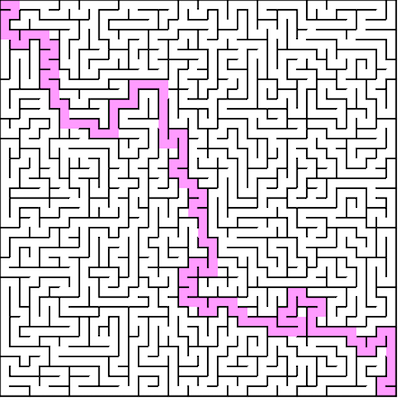
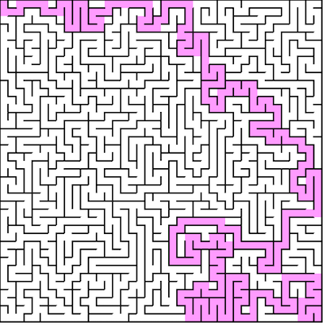

# Generating with backtracking

The [Randomized Depth / Breadth-first search][wiki] follows:

1. Make the initial cell the current cell and mark it as visited
2. While there are unvisited cells
    1. If the current cell has any neighbors which have not been visited
        1. Choose randomly one of the unvisited neighbors
        2. Push the current cell to the stack
        3. Remove the wall between the current cell and the chosen cell
        4. Make the chosen cell the current cell and mark it as visited

    2.Else if stack is not empty
        1. Pop a cell from the stack
        2. Make it the current cell

## Implementing backtracking
In essence, this algorithm starts at a vertex `u`, randomly visits an adjacent
vertex `v` that has not been visited yet - destroying barriers (walls of pixels) between
the current and previous vertices to create an edge, and repeats this until all vertices are visited and we have a spanning tree.


Pseudo code follows:

```
backtrack(src) {

	var unvisited = []  // Stack or Queue
	var neighbors = []  // Array
	var curr
	var next
	var i

	// Make the initial cell the current cell
	curr = src

	do {

		// Mark current as visited
		curr.visited = true

		// Get neighbors
		neighbors = curr.neighbors()

		// If at least one came back
		if (neighbors.length > 0) {

			// Pick random index
			i = random(0, neighbors.length)

			// Pick random neighbor
			next = neighbors[i]

			// Push to stack
			unvisited.push(next)

			// Remove wall (create edge)
			removeWall(curr, next)

			// Point current to next
			curr = next

		// No neighbors, start backtracking
		} else {

			curr = unvisited.pop()
		}

	} while (unvisited.length > 0)

}
```

The above algorithm can be written as DFS, BFS, or even a hybrid.

<p align="center">
  <br>
  <i>A maze generated with DFS.</i>
</p>

If implemented with DFS, the resulting maze will have a relatively long solution path, but relatively "easy" to solve by a computer using graph algorithms because there is a lower brancing factor. This means dead ends are relatively short and there are less paths that are seemingly reasonable but lead no where. Instead, the solution may take many twists and turns around the entire maze to get to the target.

<p align="center">
  <br>
  <i>A maze generated with BFS.</i>
</p>

Generating the maze with BFS will result in a maze with a much higher branching factor, meaning the depth of the spanning tree will be lower. This means we will get a shorter solution path, so the maze is more solvable for humans. However, for graph algorithms, they will generally take longer to solve because there are many more "promising" paths that branch off to eventual dead ends.

<p align="center">
  <br>
  <i>A maze generated with BFS / DFS hybrid.</i>
</p>

Finally, we can implement a hybrid where sometimes we push, and sometimes we pop from the unvisited queue. This will result in a maze that is less difficult than mazes produced by DFS, so still solvable by a human, but less predictable than BFS mazes, so it remains interesting. Alternating between pushing and popping with 50:50 probability works well.

## Time complexity with backtracking
As noted, we are using depth / breadth-first search to generate the graph. To **traverse** a graph
we visit each node once, which is `O(|V|)`. But, we also must check all adjacent vertices per vertex.
This we can do in `O(1)` time because edges are simply stored as boolean values per grid cell.
We must check all four (top, bottom, left and right) edges, per vertex. This is `4 * O(1)`
which is still `O(1)`. So, we are doing `|V|` loop iterations, each of which does `O(1)` work.

**Generating the maze with backtracking is done in** `O(|V|)` **time.**

## Space complexity with backtracking
The only auxiliary space we use is the stack / queue
structure for queuing vertices for processing. In the worst case, the depth / breadth-first search
traverses the entire graph without repetition / backtracking. This would mean all `|V|` vertices are
pushed on to the stack before any popping (visiting) occurs.

**Generating the maze with backtracking requires** `O(|V|)` **space.**
