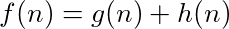

# Solving with A* search
The limitations of Dijkstra's algorithm is the reason we use A* (A Star). A* is an **informed search** that uses a heuristic function to help guide our search.

## What is a heuristic?
The heuristic is an easy-to-compute value computed for each discovered vertex that we use to determine whether or not we are getting closer to our target. The equation follows.

   

The function `g(n)` is the cost associated with getting to that vertex. `h(n)` is the estimate (heuristic) cost **between** that vertex and the target vertex. The sum `f(n)` is an overall **estimated** cost from start to finish if the current node is in the final solution. In other words:

*"If we visit node* `n`*, we anticipate the overall cost of the solution to be* `f(n)` *based on how far we have gone,*`g(n)` *plus how far we think we have to go,*`h(n)`*."*

For this reason, when ordering nodes in the priority queue, we want to sort such that nodes that warrant smaller `f(n)` values have higher priority.

## Restrictions on heuristics
The `h(n)` function is very useful in that it helps us rule out expanding too wide and taking too many intermediate steps that stray away from the target.

However, there are some restrictions on `h(n)`.

1. The unit should be the same as that `g(n)`.
2. It **should** be admissible.

If the unit of the heuristic function is not the same as the unit used by `g(n)`, then we are not approximating the **cost** - we are computing some other value. For example, for grids, sometimes the euclidian distance squared is used as the heuristic. If we are computing distance in centimeters, `g(n)` is in centimeters, and `h(n)` is in centimeters squared. We cannot add centimeters and centimeters squared. If we add just their magnitudes (ignoring units), provided that centimeters squared is an order of magnitude larger than centimeters, we will be imposing a **huge** bias on the heuristic over the aggregated cost `g(n)`. It turns out weighting the heuristic may be a good thing, but there are also some draw backs - most notabely that it breaks admissibility.

A heuristic function is **admissible** if it never overestimates. For the purpose of traversing a weighted graph using A*, this means the heuristic never returns an estimate path cost that exceeds the minimum cost path from the current node to the target. If it does, then the `f(n)` overestimates, gets assigned a lower priority in the priority queue, and potentially never gets explored if the target is found before it is dequeued. This will result in a sub-optimal solution because we have **narrowed the search too much**.

The advantage of a non-admissible heuristic is if there are not many obsticals A* will not stray off on to too many paths because it is making decisions almost entirely based on the heuristic. For a good heuristic, this means we will find a solution very quickly - often times in a small amount of steps. The disadvantage is that a heuristic that overestimates is effectively overlooking potentially better options - kind of like tunnel vision.

So, even though A* with a weighted heuristic will run very fast, if it is not admissible, it may not always return the optimal solution. For most applications this is okay, as it may be more valuable to find a solution that is slighlty sub-optimal extremely quickly than to do a near exhaustive search to find the exact optimal solution. There is math that says that we can pick a non-admissible heuristic that guarantees solutions with a cost that is some scalar multiple ε of the optimal solutions cost, where ε ≥ 1. Essentially we are "limiting the inefficiency" of the solution by some epsilon. This is called an ε-admissible heuristic. However, that is beyond the scope of this project.

## Chosing a heuristic
Deciding on a heuristic function is highly dependent on the nature of the problem. For example, for a grid where diagonal movement is allowed, the straight-line (euclidian) distance is a good choice.

However, for grids where only lateral movement is allowed euclidian almost always **underestimates** because we cannot actually ever go in a straight line. This is okay, as it will still lead to an optimal solution, but because it consistently underestimates, we will branch out very far and explore many more options than necessary. A better heuristic is manhattan distance.

Manhattan distance is essentially creating a triangle between two points and instead of taking the length of the hypotenuse (euclidian distance), we sum the lengths of the other two sides. It can also be seen as follows:

*You are in the upper-west side of Manhattan and you would like to get to the lower-east side. You compute your distance to your target by counting the number of blocks downtown you must walk and summing that with the number of blocks crosstown you must walk.*

This gives us a more accurate yet still admissible approximation. In fact, for our purpose, if our maze had no walls, the manhattan distance would be a perfect heuristic, meaning it always estimates the exact distance to the target every time, thus producing a search that finds the optimal solution on it's first try and does not visit vertices that do not contribute to the final solution.

## Implementing A*
The code for A* is nearly identical to that of Dijkstra's algorithm. The only difference is the function used when assigning order in the priority queue.

Pseudo code follows:

## Time complexity of A*

A* in the worst case degrades to Dijkstra's algorithm. This occurs when the heuristic function severely underestimates on each iteration and never rules out any adjacent nodes to visit. In other words, if `h(n) = 0` for all nodes, A* is equivalent to Dijkstra's algorithm. In that event, we visit all `|V|` vertices, each of which requires a `pop()` and up to 4 `push()`operations on the min heap - each of which is `O(log |V|)`. This results in `O(|V| * log |V|)` operations.

**Solving the maze with A* is done in** `O(|V| * log |V|)` **time.**

## Space complexity of A*

A* uses a priority queue of unvisited vertices. In the worst case, we
push all `|V|` vertices before popping. This is the case where we visit **all** vertices in a single walk before hitting a dead end. The map used for backtracking in the worst case will hold references to all `|V|` vertices in the path from source to destination - also using at most `O(|V|)` space. Lastly, if we pre-compute our heuristics for easy lookup (one per vertex), we will need `O(|V|)` extra space - still resulting in linear space.

**The space complexity of A* is** `O(|V|)`.
